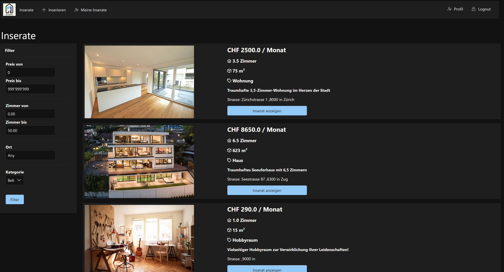

<a name="readme-top"></a>


<!-- PROJECT LOGO -->
<br />
<div align="center">
  <a href="https://github.com/othneildrew/Best-README-Template">
    
  </a>

<h3 align="center">Bude4U JEE Projekt</h3>

  <p align="center">
    Ein Projekt für das Modul "Java Enterprise Edition" an der Fernfachhochschule Schweiz
  </p>
</div>


<!-- ABOUT THE PROJECT -->
## Über das Projekt

Die Anzeigenplattform Bude4U ist ein Pionierprojekt mit dem Ziel, eine innovative und benutzerfreundliche Lösung für die Verwaltung von Immobilienanzeigen anzubieten. Die Plattform ermöglicht es den Nutzern, nach dem Login ihr eigenes Profil zu verwalten, neue Anzeigen zu erstellen und bestehende Anzeigen zu bearbeiten oder zu löschen. Ein zentraler Fokus liegt darauf, dass alle veröffentlichten Anzeigen jederzeit für alle Nutzer zugänglich sind und relevante Informationen zu den Objekten transparent dargestellt werden.

Das Projekt beinhaltet auch Funktionen wie das Filtern von Inseraten nach verschiedenen Kriterien, die Möglichkeit für Benutzer, ihre eigenen Inserate in einer separaten Ansicht anzuzeigen, und die Integration von verschiedenen Themen zur Anpassung der Benutzeroberfläche. Die Anwendung strebt nach intuitiver Bedienbarkeit und Responsivität auf verschiedenen Geräten.

Nicht nur die Funktionalität, sondern auch die nicht-funktionalen Anforderungen sind von grosser Bedeutung. Die Plattform soll auf einer skalierbaren Infrastruktur basieren, die in der Lage ist, steigende Nutzerzahlen zu bewältigen und eine hohe Verfügbarkeit zu gewährleisten. Die Sicherheit wird durch Authentifizierung und Autorisierung gewährleistet.

Mit einem klaren Fokus auf Qualitätsszenarien wird dieses Projekt dazu beitragen, die Bedürfnisse von Immobilieninteressenten zu erfüllen und eine robuste und benutzerfreundliche Plattform für die Verwaltung von Immobilienanzeigen zu schaffen.

<p align="right">(<a href="#readme-top">zurück zum Anfang</a>)</p>


### Technologien

In diesem Abschnitt werden alle wichtigen Frameworks/Bibliotheken aufgelistet, die für die Erstellung des Projekts verwendet wurden. 
* [JakartaEE 10](https://jakarta.ee/release/10/)
* [Primefaces](https://www.primefaces.org/#)
* [Azure PostgreSQL](https://azure.microsoft.com/en-us/products/postgresql)
* [Glassfish 7.0.7](https://javaee.github.io/glassfish/download)

<p align="right">(<a href="#readme-top">zurück zum Anfang</a>)</p>


<!-- GETTING STARTED -->
## Getting Started

Um eine lokale Kopie zum Laufen zu bringen, folgen Sie diesen einfachen Schritten.

### Vorarbeiten


* Glasfish 7.0.7 installieren
  ```sh
    https://javaee.github.io/glassfish/download
  ```

### Installation

Die folgenden Schritte führen Sie durch die Installation des Projekts auf Ihrem lokalen Rechner.

1. Klonen Sie das Projektarchiv
   ```sh
   git clone https://github.com/ffhs-projects/Bude4U/tree/master
   ```
2. persistence.xml kopieren
   ```sh
   Das persistence.xml File in der Metainf Ordner im Verzeichnis  src/main/resources kopieren
   ```
3. Glasfish Server in der IDE starten


<p align="right">(<a href="#readme-top">zurück zum Anfang</a>)</p>


<!-- LICENSE -->
## Lizenz

Verteilt unter der MIT-Lizenz.

<p align="right">(<a href="#readme-top">zurück zum Anfang</a>)</p>